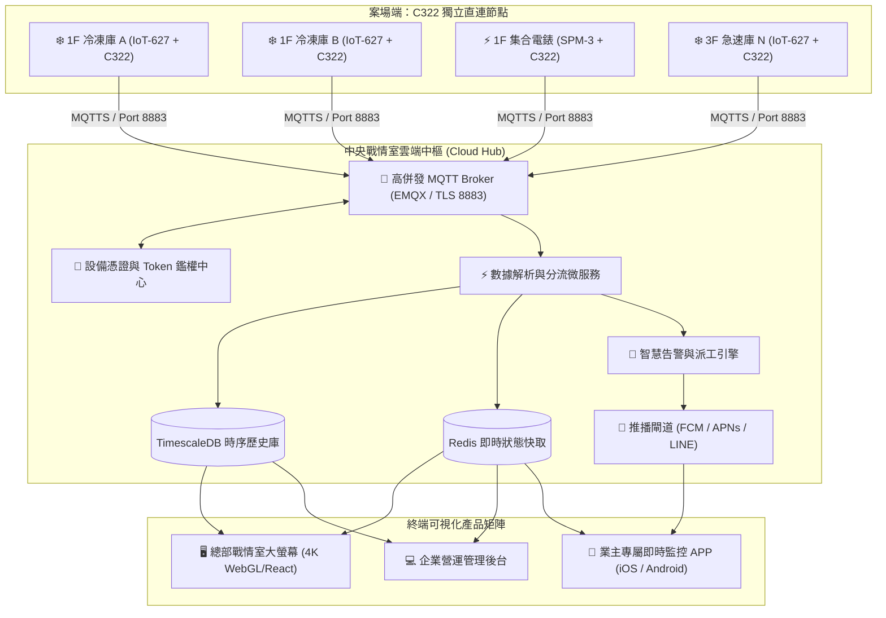

# 🏢 智慧冷鏈與能源管理 - 中央戰情室系統 (Central War Room)
## 專案規格與系統架構規劃書（v2.0 - C322 TLS-MQTT 直連與業主 APP 布局）

---

## 📌 一、專案背景與未來硬體布局戰略

本系統專為「新世代工業冷鏈 IoT」設計，架構具備**向下相容（現行案場 W610 網關）**與**未來標準化主力（C322 單機 TLS-MQTT 直連）**的雙軌擴展能力。

```text
【現行案場過渡架構】                     【未來標準化主力架構 (C322 TLS-MQTT)】
RS-485 設備 1 ──┐                       RS-485/IoT 設備 1 ── [C322] ──(TLS-MQTT)──┐
RS-485 設備 2 ──┼─> [W610 網關] ──> 雲端   RS-485/IoT 設備 2 ── [C322] ──(TLS-MQTT)──┼─> [中央戰情室 MQTT 集線中樞]
RS-485 設備 N ──┘ (單點故障風險/需輪詢)    RS-485/IoT 設備 N ── [C322] ──(TLS-MQTT)──┘ (單機獨立直連/極致低延遲)
                                                                                  │
                                              ┌───────────────────────────────────┴───────────────────────────────────┐
                                              ▼                                                                       ▼
                                    🖥️ 【總部中央戰情室】                                                    📱 【業主專屬行動 APP】
                                   (4K 大螢幕 / 多案場 GIS / 全球監管)                                       (iOS / Android 口袋戰情室)
```

### 🎯 核心效益
1. **單機獨立直連（消除單點故障）**：C322 模組直接嵌入或串接各溫控器/電錶，單一台設備斷網完全不影響其他設備。
2. **TLS-MQTT 主動推播（極致省流量與低延遲）**：摒棄傳統雲端主動輪詢（Polling），改由設備端定時/變量主動發布（Publish），封包 Header 僅 2 bytes，流量省 90% 以上。
3. **LWT (Last Will) 瞬時斷線感知**：利用 MQTT 遺囑機制，設備離線毫秒級觸發警告，無須等待漫長逾時判定。
4. **雙端產品矩陣**：
   - **總部端**：4K 戰情室大螢幕 + Web 集中營運後台（全局監控、HACCP 稽核、ESG 能源評比）。
   - **業主端**：專屬 Mobile APP（口袋戰情室、即時庫溫、超溫推播、一鍵報修）。

---

## 🏗️ 二、C322 TLS-MQTT 雲端通訊拓撲與架構



---

## 📡 三、C322 MQTT 主題 (Topic) 與資料協議規範

採用標準層級化命名規範，支援未來橫向擴展數千台設備：

### 1. Topic 結構定義
```text
corp/{corp_id}/site/{site_id}/device/{device_id}/{action}
```
* `corp_id`：企業/集團代碼（如 `yjh` 裕珍皇）。
* `site_id`：案場代碼（如 `factory_1f` 一廠、`hub_taichung` 台中物流倉）。
* `device_id`：設備唯一識別碼 / MAC / 序號（如 `c322_ch01`, `c322_spm_01`）。
* `action`：
  - `telemetry`：即時數據上報（定時 10s 或變量觸發）。
  - `status`：在線心跳 / LWT 遺囑訊息。
  - `alarm`：即時警報事件（高低溫、設備跳脫）。
  - `cmd`：雲端/APP 下發控制指令（設定溫度、開關機）。
  - `cmd_ack`：設備執行結果回執。

### 2. 核心 Payload 格式 (JSON 輕量規範)

#### 🌡️ 溫度即時上報 (`.../device/c322_ch01/telemetry`)
```json
{
  "ts": 1771465200,
  "temp": -18.2,
  "coil": -22.5,
  "cur": 4.8,
  "hp": 1.45,
  "lp": 0.28,
  "cooling": 1,
  "defrost": 0,
  "status": "NORMAL"
}
```

#### 🔌 LWT 離線遺囑宣告 (`.../device/c322_ch01/status`)
```json
{
  "online": 0,
  "reason": "unexpected_disconnect",
  "ts": 1771465200
}
```
> 💡 *設備連線時設定此遺囑，若 Wi-Fi 斷線或斷電，Broker 會在 1 秒內自動廣播此訊息，戰情室與 APP 立即顯示離線黃燈。*

---

## 📱 四、業主專屬行動監控 APP (Mobile APP) 規格

專為企業主、廠長與設備主管打造的**「口袋裡的冷鏈戰情室」**：

```text
┌─────────────────────────────────────────┐
│ 📱 裕珍皇 冷鏈智慧管家 (業主 APP 示意)   │
├─────────────────────────────────────────┤
│ 🏢 總廠冷鏈狀態              🟢 全部正常 │
│ 庫溫合格率: 99.2%    本日耗電: 412 kWh   │
├─────────────────────────────────────────┤
│ ❄️ 即時庫溫卡片清單 (支援自訂排序)      │
│ ┌─────────────────────────────────────┐ │
│ │ 1F 冷凍庫 A                 -18.4°C │ │
│ │ 狀態: 製冷中 │ 設定: -18.0°C │ 🟢 正常 │ │
│ └─────────────────────────────────────┘ │
│ ┌─────────────────────────────────────┐ │
│ │ 1F 冷凍庫 B                 -17.9°C │ │
│ │ 狀態: 製冷中 │ 設定: -18.0°C │ 🟢 正常 │ │
│ └─────────────────────────────────────┘ │
│ ┌─────────────────────────────────────┐ │
│ │ 3F 急速庫 A                 -28.5°C │ │
│ │ 狀態: 急速凍結中             │ 🟢 正常 │ │
│ └─────────────────────────────────────┘ │
├─────────────────────────────────────────┤
│ ⚡ 耗電與需量即時監測 (SPM-3)            │
│ 瞬時功率: 34.2 kW (契約需量安全範圍內)  │
├─────────────────────────────────────────┤
│ 🚨 警報紀錄  │ 📈 歷史趨勢 │ 🛠️ 設備控制 │
└─────────────────────────────────────────┘
```

### 🎯 業主 APP 核心功能亮點：
1. **秒級即時刷新**：APP 透過 WebSocket 直接訂閱 MQTT Broker，在庫溫跳動時毫秒級平滑更新，免手動下拉刷新。
2. **原生推播通知 (Push Notifications)**：
   - 整合 Apple APNs 與 Google FCM。
   - 發生高溫、跳脫或斷線時，手機鎖定畫面立即彈出警報，點擊直接進入該庫詳細歷史曲線。
3. **多案場/多庫一鍵切換**：連鎖企業主可在一個 APP 內無縫切換不同廠區或不同門市。
4. **一鍵安全控溫 (權限授權者)**：支援手機遠端調整目標庫溫（需生物辨識 FaceID / 指紋確認）。
5. **PDF/Excel 報表一鍵分享**：透過手機直接產生當日/當週 HACCP 合規證明，並直接分享至 LINE 或 Email。

---

## 🖥️ 五、中央戰情室 (War Room 大螢幕) 核心模組

1. **🗺️ 全國案場 GIS 態勢總覽**：動態地圖標記各案場健康狀態、在線率與總庫數。
2. **❄️ 數位分身 2.5D 圖控穿透**：單擊案場無縫切入該廠 3D/2.5D 平面配置圖與各冷庫真實動態。
3. **⚡ 集團能源與 ESG 碳排中心 (EMS)**：跨廠電費排名、契約需量超約預防、尖峰用電轉移策略。
4. **🛡️ HACCP 食品安全合規動態儀表板**：溫度合格率排行榜、開門時間分析、異常失控早期預警。
5. **🚨 集中指揮與事件派工中心**：跨廠未解除告警看板、處理進度追蹤（SLA）、維修日誌閉環。

---

## 🛠️ 六、技術架構選型與通訊規範

| 領域 | 推薦技術方案 | 核心優勢 |
| :--- | :--- | :--- |
| **邊緣通訊模組** | **USR-C322 (Wi-Fi/以太網) 或 4G Cat.1 模組** | 內建硬體加密、支援 TLS 1.3、原生 MQTT Client、低功耗 |
| **MQTT Broker** | **EMQX 企業級開源叢集 (走 TLS 8883)** | 支援百萬級連線併發、規則引擎、內建 WebHook 與 時序寫入 |
| **時序資料庫** | **TimescaleDB (PostgreSQL 16 Engine)** | 超高效時序分區、原生支援 SQL 分析與超高壓縮率 |
| **戰情大螢幕前端** | **React / Next.js + ECharts + WebGL (Three.js)** | 4K/8K 滿版無縫縮放、深色科技感、高幀率渲染 |
| **業主行動端 APP** | **Flutter (Dart) 跨平台** | 單一程式碼同時產出高效能 iOS 與 Android 原生體驗 |
| **行動推播引擎** | **Firebase Cloud Messaging (FCM) + Apple APNs** | 99.9% 抵達率、鎖定畫面即時呼叫、低耗電背景喚醒 |

---

## 🗓️ 七、專案推進演進藍圖 (Roadmap)

```text
【階段 1：現有案場對接與 MVP 戰情中樞】 (3~4 週)
  ├─ 搭建中央雲端 MQTT Broker (EMQX) 與 TimescaleDB 時序庫
  ├─ 裕珍皇 W610 現有案場透過 Edge Agent 橋接轉發至 MQTT
  └─ 戰情室大螢幕 V1 (GIS 地圖 + 案場即時態勢 + 基礎告警)

【階段 2：C322 單機 TLS-MQTT 標準化導入】 (3 週)
  ├─ 製作 C322 模組標準韌體/通訊設定包 (一機一證 TLS 8883)
  ├─ 實機壓力測試 (驗證 LWT 離線感知、斷線重連機制、封包流量壓測)
  └─ 實現 C322 單機單台直接進雲端 Broker

【階段 3：業主專屬行動 APP 開發 (iOS / Android)】 (4 週)
  ├─ 業主 APP UI/UX 設計與 Flutter 雙平台開發
  ├─ WebSocket 即時數據流與 FCM / APNs 警報推播串接
  └─ 業主權限劃分與一鍵報表分享功能

【階段 4：EMS 能源管理與預測性 AI】 (3 週)
  ├─ SPM-3 跨廠能源評比與需量預警
  └─ 壓縮機劣化趨勢診斷與能效最佳化建議
```

---

## 💬 八、後續討論與硬體對接確認項目

1. **C322 網路環境配置**：
   - 案場現場的 C322 是透過**「廠區 Wi-Fi 內網」**直連外網？還是各冷庫配備獨立**「4G Cat.1 / SIM 卡模組」**？
2. **業主 APP 品牌與上架規劃**：
   - APP 是否預計上架至 Apple App Store / Google Play Store？（採用客製化企業品牌名稱與 Logo）？
3. **歷史案場 (W610) 升級策略**：
   - 既有使用 W610 的案場（如目前裕珍皇一期）是否維持軟體代理（Edge Agent）轉發 MQTT？未來新庫別再全數採用 C322 直連？
